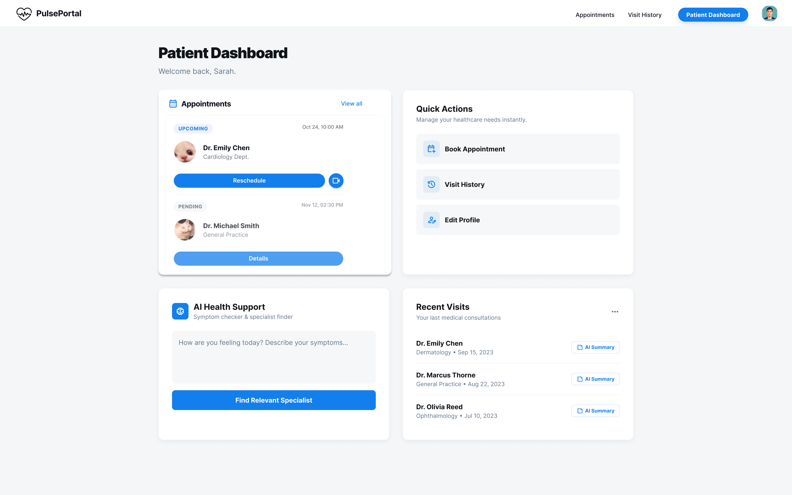
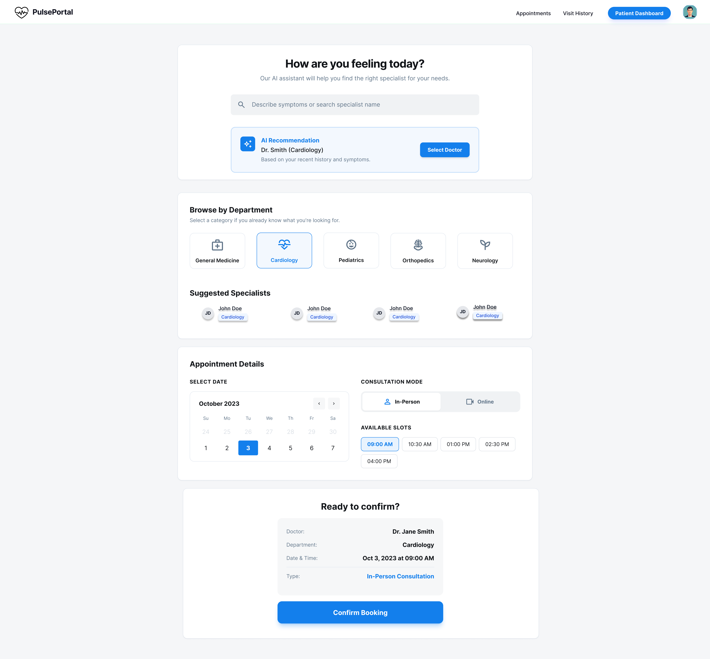
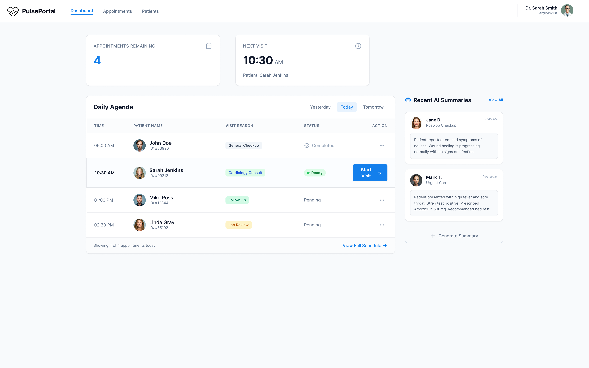
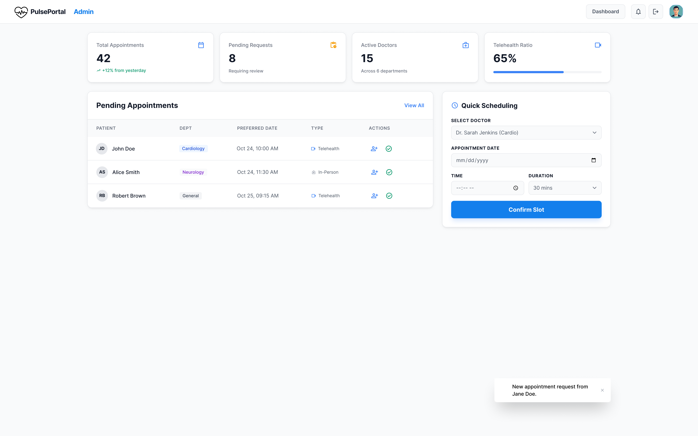

# Project Title: Pulse Portal
## Team members

| Name                     | ID             | Email                                | Role                  |
| ------------------------ | -------------- | ------------------------------------ | --------------------- |
| Samia Rahman Arpita      | 20230104007    | arpitarahmansamia@gmail.com          | Front-end Developer   |
| Kazi Md Shahadat Hasan   | 20230104008    | tamimshahadat15@gmail.com            | Back-end Developer    |
| Hrittika Saha            | 20230104024    | hrittika23.st05@gmail.com            | Lead                  |

# Project Overview

### Objective

The objective of Pulse Portal is to develop an intelligent healthcare support system that enhances patient access to healthcare services and improves consultation management for doctors and professionals. By integrating structured appointment workflows with AI-assisted guidance, summarization, and administrative support, the system aims to facilitate informed decision-making, reduce communication barriers, and improve overall operational efficiency.

### Target Audience

- **Patients** seeking a simple and organized platform to request healthcare consultations, manage appointments, and understand medical symptoms better.

- **Doctors and professionals** who require a structured system to manage consultations, review patient histories, and document visits.

- **Hospital administrative staff** responsible for coordinating appointment requests, scheduling consultations, and managing doctor availability.

# Tech Stack

### 1. Backend
* **Laravel (PHP)** 

### 2. Frontend
* **React**
* **TailwindCSS/ Bootstrap / MUI**

### 3. Rendering Method
* **Client-Side Rendering (CSR):** Adopted to provide a smooth, interactive experience for role-based users without the need for SEO.

### 4. Database
* **MySQL:** Will store patient profiles, doctor information, appointments, visit records, and AI-generated summaries.

### 5. AI Integration
* **OpenAI / Gemini API:** Will be used for AI-assisted features such as recommending specialists based on symptoms, generating visit summaries, and providing decision-support guidance.

### 6. Suporting Tools
* **JWT:** For secure authentication and API communication.

# UI Mockups

### Landing Page

  

### Patient Dashboard

  

### Appointment Booking

  

### Doctor Dashboard

  

### Admin Dashboard

  

### Figma Link: https://www.figma.com/design/2R43AosEDGOxKwGeT3RqdJ/PulsePortal?m=auto&t=rdkGS48Rce4pU5TD-1

# Project Features

## 1. Main Features
* **Patient Management:** Patient registration, profile updates, appointment requests, and access to visit history.

* **Doctor Dashboard:** View assigned appointments, patient history access, and visit notes.

* **Appointment Management:** Structured appointment request, review, and support for both in-person and online consultations.

* **Role-Based Access Control:** Secure authentication and authorization for patients, doctors, and hospital staff based on assigned roles.

## 2. AI Intregrated Features
* **Specialist Recommendation:** Suggest appropriate departments or specialists based on patient-reported symptoms.

* **Visit Summarization:** Generate simplified, patient-friendly summaries from doctor notes.

* **Past Visits Summarization:** Provide concise summaries of past visits to help doctors better understand their patients medical history.

\| *AI features are designed for understanding and decision-making and do not provide medical diagnoses or treatment recommendations.*

## 3. CRUD Operations
* **Patients:** Create and update patient profiles and retrieve visit-related information.

* **Doctors:** Maintain doctor information including availability and specialization.

* **Appointments:** Create appointment requests, view schedules, update appointment status.

* **Visit Notes:** Record and retrieve visit notes and summaries added by doctors.

## 4. Key API Endpoints (approx.)
* **POST /auth/register** – Patient registration

* **POST /auth/login** – Login for all user roles

* **GET /patients/appointments** – View patient appointments

* **POST /patients/appointments** – Request a new appointment

* **GET /doctors/appointments** – View doctor scheduled appointments

* **POST /doctors/visit-notes** – Add visit notes

* **GET /patients/visit-history** – Fetch visit summaries

* **PUT /admin/appointments/{id}/schedule** – Admin schedules appointments

* **POST /admin/doctors** – Add doctor accounts

* **POST /patients/ai/specialist-recomm** – Suggest specialists based on symptoms

* **POST /doctors/ai/visit-summary** – Generate simplified summaries from past visit notes.

# Milestones

### Milestone 1: Core System Setup & Authentication

* Database design and initial schema (patients, doctors, admins, appointments)
* JWT-based authentication and role-based access control
* Patient registration and unified login system
* Design basic dashboards for patients, doctors and admins
* API integration between frontend and backend

### Milestone 2: Appointment & Consultation Management

* Patient appointment request and management
* Doctor appointment viewing and status updates
* Admin appointment reviewing
* Visit history and consultation record storage

### Milestone 3: AI Integration & Finalization

* Basic online consultation support
* AI-assisted specialist recommendation based on symptoms
* Historical visit summarization for patients
* UI enhancements and improved user experience
* Testing, bug fixing, and final deployment preparation
